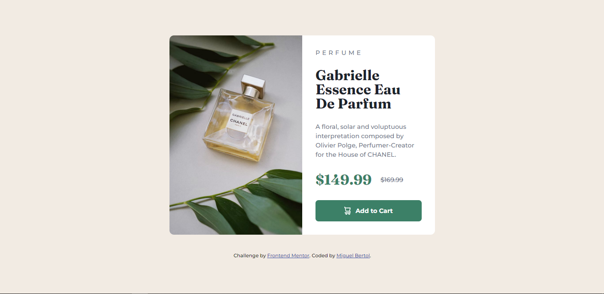

# Challenge Solution - Product preview card component

This is a solution to the [Product preview card component challenge on Frontend Mentor](https://www.frontendmentor.io/challenges/product-preview-card-component-GO7UmttRfa).
## Table of contents

## Table of contents

- [Overview](#overview)
  - [Screenshot](#screenshot)
  - [Links](#links)
- [My process](#my-process)
  - [Built with](#built-with)
  - [What I learned](#what-i-learned)
  - [Continued development](#continued-development)
  - [Useful resources](#useful-resources)
- [Author](#author)

## Overview

The challenge is to build out an Product preview card component and get it looking as close to the [design reference](design/desktop-preview.jpg) as possible and with [its active states](design/active-states.jpg).

### Screenshot

My solution:



### Links

- [Product preview card component - Solution]()
- [Product preview card component - Live Site]()

## My process

In this challenge after defining all the html tags and classes, I started styling the Desktop layout CSS first (Next time I want to try mobile first).

In CSS it was simple to solve the card layout using flexbox. I even thought about using Grid, but as I'm still not very used to it I ended up using just flexbox.

After styling everything to look as similar as possible to the desktop design reference, it was time to design for mobile. I was still very new to responsive designs in general, but for sure after this challenge I improved this skill a lot and learned a lot too.


### Built with

- HTML5
- CSS3

### What I learned

While I was building the layout there were some design elements that I didn't know how to do in CSS so I had to look up the properties for them:

#### text-decoration
```css
/* This property and value put a line-through the text equal to the one placed in "$169.99" */
.card-texts-prices-offer {
    text-decoration: line-through;
}
```

#### cursor
```css
/* This property and value change the cursor to 'pointer' to indicate to the user that the element is clickable */
.card-texts-btn:hover{
    cursor: pointer; 
}
```
#### content
```css
/* This property can change the content from any element of the page. In this case I use it to set the image from the card */
/* instead of using  because this way I could put different images in accord to the user's screen size */
.card-product {
    content: url(images/image-product-desktop.jpg);
}
```

#### transition
```css
 /* This propety define the transition between two states of an element, like the way I used between the responsive layouts */
.card-product {
    transition: all .5s;
}
```

#### @media

My biggest learning from these challenges was using the @media rule to define the changes of each element (class) for the mobile design:

```css
@media screen and (max-width: 680px) {
    .container {
        gap: 1rem;
    }
    
    .card {
        width: 35rem;
        flex-direction: column;   
    }  
      

    .card-texts {
        gap: 1.5rem;
    }

    .card-texts-prices {
        margin-top: 0.5rem;
    }

    .card-product {
        width: 100%;
        content: url(./images/image-product-mobile.jpg);
        border-radius: 1rem 1rem 0 0;
    }
}
```

[Useful resources](#useful-resources)

### Continued development

In general, I've gotten quite used to flexbox to build the layout so in the next projects I intend to find opportunities where grid can be used, but of course without complicating things just for that reason. Also, in terms of responsiveness I'll try to do mobile first next time and then use media queries for desktop.

### Useful resources

- [text-decoration property](https://developer.mozilla.org/pt-BR/docs/Web/CSS/text-decoration)
- [cursor property](https://developer.mozilla.org/en-US/docs/Web/CSS/cursor)
- [content property](https://developer.mozilla.org/en-US/docs/Web/CSS/content)
- [transition property](https://developer.mozilla.org/en-US/docs/Web/CSS/transition)
- [CSS @media rule](https://www.w3schools.com/cssref/css3_pr_mediaquery.asp)

## Author

- Frontend Mentor - [@miguelbcodes](https://www.frontendmentor.io/profile/miguelbcodes)
- Twitter - [@miguelbcodes](https://www.twitter.com/miguelbcodes)