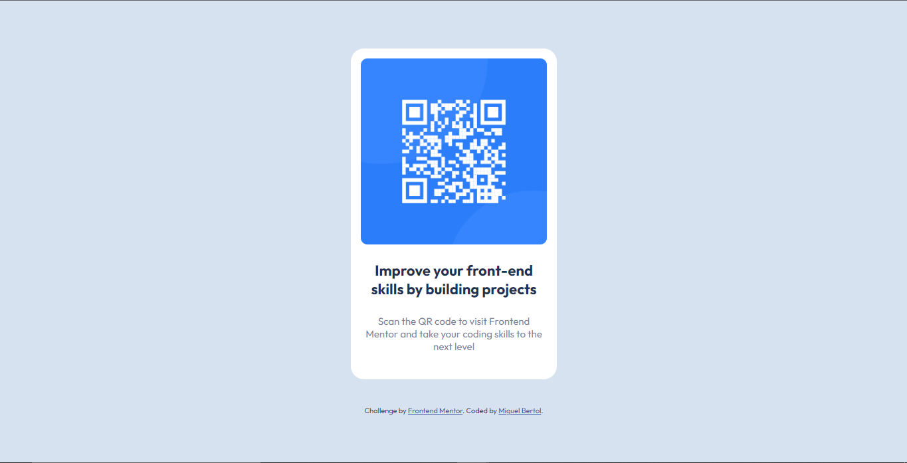

# Challenge Solution - QR Code Component

This is a solution to the [QR code component challenge on Frontend Mentor](https://www.frontendmentor.io/challenges/qr-code-component-iux_sIO_H).

## Table of contents

- [Overview](#overview)
  - [Screenshot](#screenshot)
  - [Links](#links)
- [My process](#my-process)
  - [Built with](#built-with)
  - [What I learned](#what-i-learned)
  - [Continued development](#continued-development)
  - [Useful resources](#useful-resources)
- [Author](#author)

## Overview

The challenge is to build out an QR code component and get it looking as close to the [design reference](design/desktop-preview.jpg) as possible.

### Screenshot

This is my result:



### Links

- [QR code component - Solution]()
- [QR code component - Live Site]()

## My process

In this challenge I started by marking all the necessary elements (Not forgetting the semantics of HTML!) and classes in the index.html file, as well as linking it with the style.css file.

In styling, in addition to resetting the defaults to avoid problems, I defined all colors as variables inside :root.

Getting into the more complicated part of the challenge (styling the component itself) I had a bit of trouble remembering some flexbox properties, but overall it was easy to do because I had already seen some sources.

### Built with

- HTML5 Ma
- CSS3

### What I learned

Something intersting that I learned this time is how to use the unit "rem" instead of using absolute length units e.g. pixels:

```css
    .card {
        max-width: 31rem;
    }
```


But the biggest learning that I got in this challenge was about the flexbox properties "flex-direction", "justify-content" and "align-itens", which are important functions in positioning using flexbox and are correlated with respect to flexbox axes.

```css
    flex-direction: column; /* This establishes the main-axis */
    justify-content: center; /* This defines the alignment along the main axis. */
    align-items: center;  /* This defines the default behavior for how flex items are laid out along the cross axis on the current line. */
```


### Continued development

For the next projects I intend to continue using relative length units and discover other applications for flexbox.

### Useful resources

- [The Box Model](https://developer.mozilla.org/en-US/docs/Learn/CSS/Building_blocks/The_box_model)
- [Learn CSS Units In 8 Minutes](https://www.youtube.com/watch?v=-GR52czEd-0)
- [A Guide to Flexbox](https://css-tricks.com/snippets/css/a-guide-to-flexbox/)

## Author

- Frontend Mentor - [@miguelbcodes](https://www.frontendmentor.io/profile/miguelbcodes)
- Twitter - [@miguelbcodes](https://www.twitter.com/miguelbcodes)